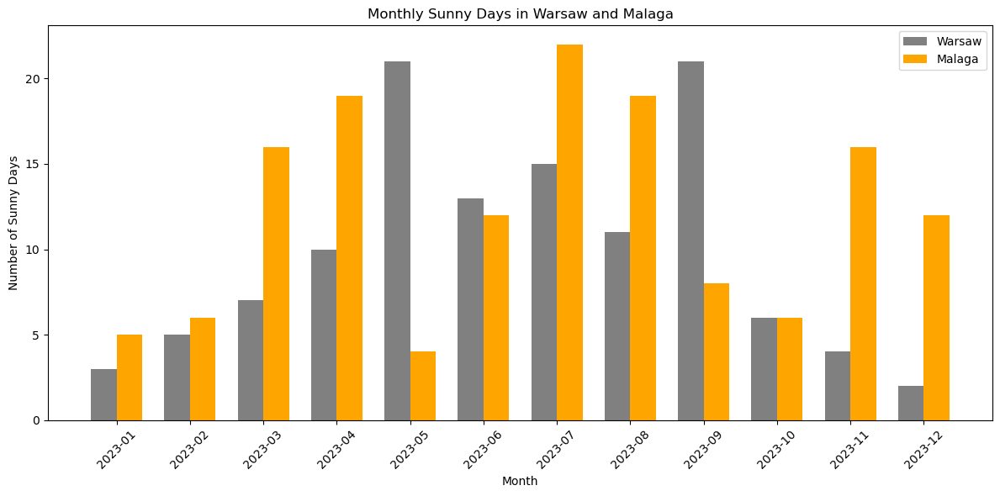

# Sunshine Analysis: Malaga vs. Warsaw in Jupyter Notebooks

This repository contains a Jupyter Notebook that analyzes and visualizes the number of sunny days in Malaga, Spain, and Warsaw, Poland, to determine which city experiences more sunny days over a year.

## Overview

The analysis is performed in a Jupyter Notebook environment to allow an interactive approach to data processing and visualization. The notebook includes the code for fetching weather data, defining what constitutes a sunny day, and plotting the data for a comparative visual analysis.

## Definition of a Sunny Day

In this analysis, a 'sunny day' is defined by the following criteria:
- The cloud cover is less than 20%.
- The total precipitation is less than 1mm.

These criteria are used to filter the days that are considered sunny from the weather data obtained.

## Data Source

The weather data is sourced from the OpenWeatherMap API, focusing on historical weather patterns to count the number of sunny days in each city. The API's response for each day's weather data is stored in JSON format in a directory named `data` within this repository.

The `data` directory structure is as follows:
- `data/`
  - `weather_data_lat{latitude}_lon{longitude}_{date}.json`: Individual JSON files for each day's weather data, named by the geographic coordinates and the date of the data.

The weather data JSON files are generated by the Jupyter Notebook when it fetches data from the API. If a file corresponding to a specific date already exists in the `data` directory, the Notebook will use this local file instead of making a redundant API call. This simple caching mechanism ensures efficient use of network resources and API rate limits.

## Notebook in the Repository

- `weather_analysis.ipynb`: The Jupyter Notebook containing the Python code for fetching weather data from the OpenWeatherMap API, processing it to count sunny days according to the specified criteria, and generating visualizations to compare the sunny days between Malaga and Warsaw.

## Key Findings from the Weather Analysis

Upon analyzing the weather data for 2023, we observed that:
- Malaga generally has more sunny days per month than Warsaw, which is expected given its Mediterranean climate.
- Both cities have the fewest sunny days during the winter months, with November through January being the least sunny.
- The sunniest months for Malaga are typically May and August, while Warsaw also shows increased sunniness during these months, although not as pronounced as Malaga.

These insights suggest that for sun-seekers, Malaga is the preferable destination, especially from spring through to early autumn.

## How to Run

1. Ensure you have Jupyter Notebook or JupyterLab installed.
2. Clone the repository to your local machine.
3. Navigate to the repository directory and launch Jupyter Notebook or JupyterLab.
4. Open the `weather_analysis.ipynb` notebook and run the cells sequentially.

## Contributing

Contributions to the project are welcome! Please feel free to fork the repository, make your changes, and submit a pull request
